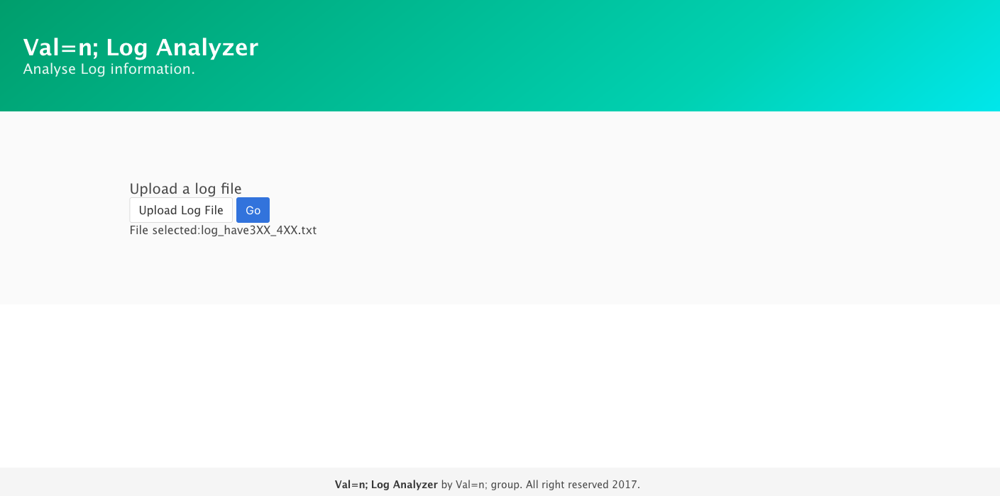

# Module 1 Group Assignment: The Describerator

CSCI 5117, Fall 2017

[Assignment description](https://docs.google.com/document/d/1956Z3EZJi9RWU6JqPHEh5ZZBmDOKFex-HtsBLz66tt4/edit#)

Please fill out all of the following sections to help us grade your submission:

## Name of App: x

Log Analyser

## Name of Team: x
val=n;

## Students

* Lakshya Goel, goel0072@umn.edu
* Nishka Monteiro, monte299@umn.edu
* Akifumi Nakamachi, nakam052@umn.edu
* Vaybhav Shaw, shaw0162@umn.edu

## Link to Site

<https://tranquil-taiga-64587.herokuapp.com/>

## Key Features

**Describe the most challenging features you implemented
(one sentence per bullet, maximum 4 bullets):**

* ...

## Screenshots of Site

**[Add a screenshot of each key page (maximum 4)](https://stackoverflow.com/questions/10189356/how-to-add-screenshot-to-readmes-in-github-repository)
along with a very brief caption:**

## External Dependencies

**Document integrations with 3rd Party code or services here.
Please do not document required libraries (e.g., Express, Bulma).**

- [jquery3.2.1](https://jquery.com/): parsing dom, form processing
- [d3.js](https://d3js.org/): to using nv.d3
- [nv.d3.js](http://nvd3.org/): generating graph, chart
- [moment.js](https://momentjs.com/): parsing time much easier than js default Date() class.
- [multer](https://github.com/expressjs/multer): sending data from client to sever
- [request](https://www.npmjs.com/package/request): controlling http?. Maybe default to express. But to prevent plagiarism, I write that
- [ua-parser-js](https://github.com/faisalman/ua-parser-js): parsing user agent easily
- [Sass](http://sass-lang.com/): css preprocessor
- [Ruby](https://www.ruby-lang.org/en/): to use Sass
- [jquery flip](http://nnattawat.github.io/flip/): to add flip animation

**If there's anything else you would like to disclose about how your project
relied on external code, expertise, or anything else, please disclose that
here:**

## Links to Test Data

This project requires user-submitted data.  If you have files or other scripts
that would be necessary (or helpful) for us to test your application, please
link to them here.  For example, if your project parses gzipped apache logs,
provide a few gzipped apache logs here.

* link to file
* ...
